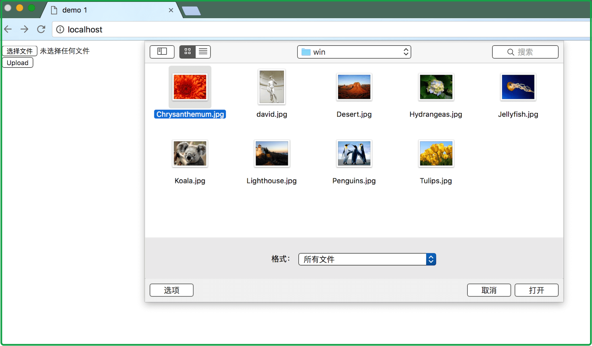
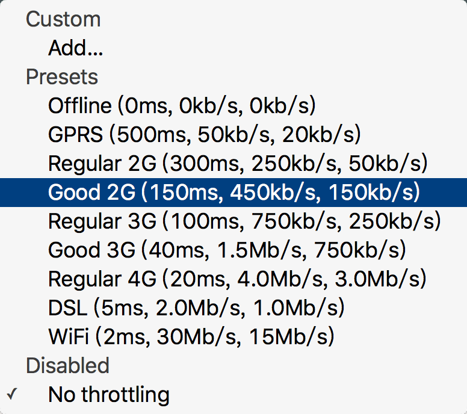

# javascript文件上传

## 目录

> [demo1 原生的上传文件，使用form实现](#demo1)   
> [demo2 plupload的原理](#demo2)  
> [demo3 moxie文件选取，fill-picker，带有预览功能](#demo3)   
> [demo4 上一个基础上，增加了文件上传，带有上传百分比通知](#demo4)   
> [demo5 使用plupload实现了图片上传](#demo5)   
> [demo6 断点续传](#demo6)   
> [demo7 plupload ui widget的示例](#demo7)   

本程序需要安装node
~~~
node官网
http://nodejs.org/download/
国内的用户可以访问山寨网站
http://lodejs.org/download/
~~~

本教程包含7个demo，安装好node后，就可以挨个运行它们了。
~~~bash
windows
下载zip文件，然后解压到c盘
c:\> cd javascript-file-upload-master
c:\> node demo1\server.js

linux or mac
$ git clone https://github.com/ktont/javascript-file-upload
$ cd javascript-file-upload
$ sudo node demo1/server.js
~~~

类推，运行demo2的时候，去执行demo2下的server.js就可以了。

然后在浏览器中(建议chrome)执行
~~~
http://localhost
~~~
就可以了。

如果你遇到EADDRINUSE的错误，那是因为80端口已经被其它诸如apache、nginx的程序占用了。
可以在启动的时候指定端口, 比如端口3000。

~~~bash
$ node server.js 3000
~~~

## 1、原生的上传文件，使用form实现

首先，来看第一个例子。
它是一个原生的文件提交方法，前端只有一段html而没有js。我们的目的是观察http协议的格式。

前端index.html，使用一个input标签进行文件选择，然后使用form表单发送数据。
后端server.js（没错～后端程序也由我们编写），对表单发过来的数据进行解析，并用便于观察的方式打印出来。

点击 选择文件 后

在点击 Upload 按钮之前，对网络进行限速，方便观察数据传输的过程

点击后，选取

服务端会打印下面的提示，注意红框中的token，它用来表示二进制数据的边界。

你在server.js中可以看到解析http数据的formidable函数。
你可以调试它，用来学习http协议。

上传完成后

__TIP__: 观察。注意这个词。它是我们本次学习之旅的主要方法。你一定要运行每个例子，亲眼看到它们的结果。
它们发生了、产生结果了，你眼见为实了、反复的确认后，就熟悉了这个技术。

## 2、plupload的原理
plupload是一个文件上传的前端插件。

[它的主页](http://www.plupload.com) [它的github地址](https://github.com/moxiecode/plupload)

demo2并没有使用plupload，事实上它是自己实现了plupload，它本身就相当于plupload的v0.01版本。

通过v0.01，这20行代码来一窥plupload的原理。而不是去读plupload的上万行代码，
真是有种两岸猿声啼不住，轻舟已过万重山的感觉呀。

plupload的原理，就是拿到文件句柄后，自己发送i(XMLHttpRequest)文件。然后就控制整个过程，从中加入自己实现的功能。

* 比如，图片预览，是在拿到文件以后在新的canvas上画出新的尺寸。
* 比如，断点续传，是在拿到文件以后slice文件，从断点处开始读取。

这些操作，都有个前提，就是要拿到文件。否则，一切就无从谈起。

## 3、moxie文件选取fill-picker，带有预览功能
当你看到moxie的时候，可能会觉得莫名其妙。是这样的

打开http://www.plupload.com/docs/
最重要的一段话如下，我跟你一样，一开始读不懂。
其实我写本文的本来动力，也会为了读懂这四句话。

* Low-level pollyfills (mOxie) - have their own code base and documentation on GitHub.
* Plupload API
* UI Widget
* Queue Widget

这四句话的意思是
plupload有四个安装等级 － 初级，中级，高级，长级

* 初级，叫moxie.min.js，插件大小77k到106k不等（神马鬼？为什么不等的原因参见“编译moxie”一节）
* 中级，plupload.full.min.js，插件大小123k
      打开它看一下，发现它其实是moxie.min.js和一个叫plupload.min.js的文件合并到一起而已。
      所以plupload其实是在moxie的基础上，封装了一下
* 高级，它依赖
      jquery       137k
      jquery ui    282k
      plupload     123k
      plupload ui  30k
      一共约600k的大小
* 长级，它和高级差不多，也是实现一套ui。区别是ui是队列，前者的ui是块和列表。

那么回过头，来看这个例子。这个例子只是演示文件选择，它没有上传的功能。
只有文件选择功能的moxie插件的大小为77k，比正常功能要小30%。
那么moxie都做了什么呢，为甚么有77k这么大的体积。它解决了浏览器的兼容性问题、文件预览功能、图片压缩功能、国际化支持（就是i18n）

## 4、上一个基础上，增加了文件上传，带有上传百分比通知

## 5、使用plupload实现了图片上传。

这个例子，比较实际一点，使用plupload。plupload主要在moxie上实现一套事件驱动的机制。
同时，顺带演习上传的暂停和重传。为甚么在这里演习暂停和重传呢？因为为了区分下面的断点续传。
重传是说，不重启浏览器的前提下，重新传文件。实际场景中，可以用来解决4g网不稳定而导致的重试。
但是如果重启了浏览器或者电脑，睡个觉或者去趟三亚回来后，怎么断点续传。
没错，这次我传的是一个电影，已经传了一半了，你让我重传？
下一个例子演示断点续传。

## 6、断点续传

这次服务器的启动时，需要一个“百分比”的参数
~~~bash
$ node server.js 50%
如果同时你还要指定端口号，那么
$ node server.js 3000 50%
~~~

你可能会误认为服务器会从50%的地方把数据存起来，不是的，
它的意思是告诉客户端，“请从50%的地方把剩下的文件数据发送过来“。

客户端在发送数据前，询问服务器，上次传送的百分比。然后从这个百分比处发送剩下的数据。

这里的内容较多。。待补。先放一句“线索在这儿”，断点续传的原理是参数chunk_size。

## 7、plupload ui widget的示例

这个例子，用来展示plupload ui widget是个什么东西。
除非你看到它，否则我怎么描述都没用。
如果你看到它了，没错！就是它！
